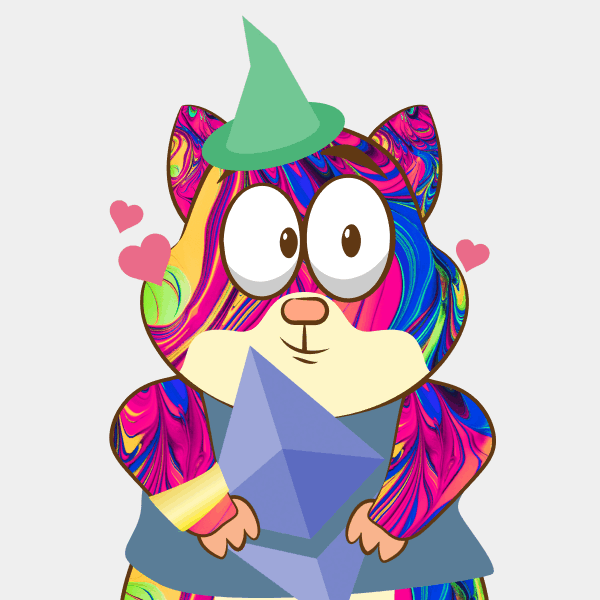

# Rinkeby Squirrels

Rinkeby Squirrels is a collection of 5555 generative art NFTs that reside on the Rinkeby test network. Rinkeby Squirrels is meant to be a sandbox environment where newcomers can safely experiment with NFTs, minting, rarity, PFPs, and communities without having to spend any real money.

If you're new to NFTs, minting, and Discord, check out this guide [here](https://medium.com/scrappy-squirrels/getting-started-with-nft-collectibles-communities-for-free-24bab021a97)

## About Scrappy Squirrels

Rinkeby Squirrels is an initiative by Scrappy Squirrels.

Scrappy Squirrels is a collection of 10,000+ randomly generated NFTs. Scrappy Squirrels are meant for buyers, creators, and developers who are completely new to the NFT ecosystem.

The community is built around education, collaboration, and opportunity. Learn about web3, explore its current use cases, discover new applications, and find members to collaborate on exciting projects with.
